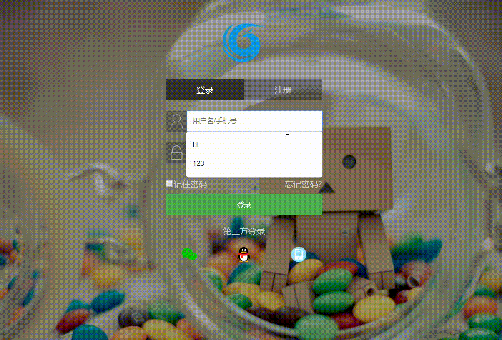

# 通用登录注册

> 由于每个网站都有一个登陆注册页，之前写的很多没进行较好验证，也不太美观，所以想着写一个相对较好的通用登录注册页面，以后就可以不用再重写了。不过手机短信验证和第三方登录需要借用接口，比较麻烦，后续再进行补充

演示demo地址：[通用登录注册演示](https://jeffrey-0.github.io/login-template/login.html)(由于数据采用json-server开启的本地服务，演示获取不了数据，建议克隆到本地进行测试)

github项目地址：[通用登录注册](https://github.com/Jeffrey-0/login-template)

## 效果截图



## 实现功能
* [x] 兼容PC、手机端
* [x] 异步验证用户存在
* [x] 字段输入规则
* [x] 记住密码
* [x] 登录注册返回提示
* [ ] 手机短信验证
* [ ] 第三方登录

## 安装使用

**安装**：

```shell
$ git clone https://github.com/Jeffrey-0/login-template
```

**测试**：

1. 在命令行cd到本项目地址，如果没有下载json-server，要先下载

   ```shell
   npm install -g json-server
   ```

2. 开启数据接口

   ```shell
   json-server user.json
   ```

3. 打开login.html文件


## 自定义配置

* 背景图`img/bg.jpg`替换
* 项目logo图`img/logo.png`替换
* ...